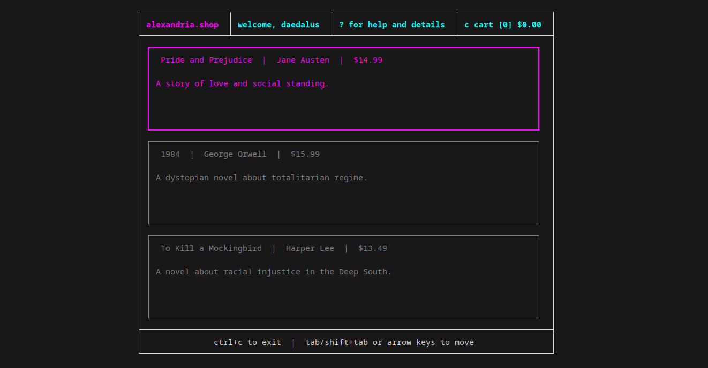
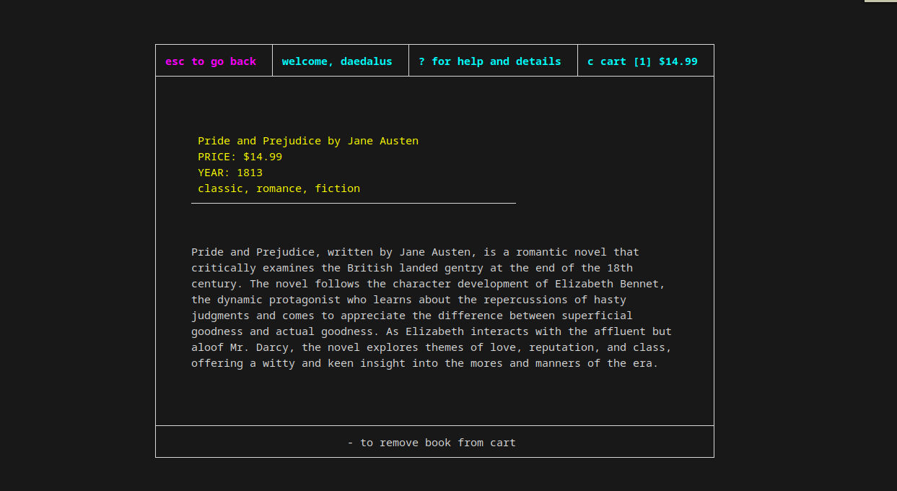

# alexandria.shop
## Screenshots 

* welcome to **alexandria.shop**


* main catalogue view of **alexandria.shop**


* details of a book selected including price and author

## What's this?
**alexandria.shop** is a fictional terminal shop from the mid 90s that sold books of all
kinds and was served over SSH. Users connected to the service via ssh and had to authenticate
themselves in order to fully use the service. The name for the service is derived from the
famous ancient library of Alexandria!  
  
It provided ground breaking features such as a cart system that allowed users to keep
track of their purchases and a checkout that sent the receipt of the user's purchase to their
email! It handled all this and more over a SQL database that tracked and authenticated users.  
   
This was a revolutionary idea that was incredibly rare as no other competitor was
doing anything with email. **alexandria.shop** was truly ahead of its time but unfortunately, its
maintainers didn't adapt quick enough to the changing market and increasing demand for services
to be served as websites and as such, the features that distinguished **alexandria.shop** from
other "online" bookshops ended up being what killed them as a small company called Amazon
started to gain headway in the market.

This is a love letter to **alexandria.shop** that serves to provide a look into the past and remind
us of technology we may have forgotten as time has gone by.  
**alexandria.shop** is heavily inspired by terminal.shop, a coffee company that sells its products
via SSH on the terminal.


## Technology Used
**alexandria.shop** is only possible because of the awesome technology below. Check each one out!  
* [bubbletea](https://github.com/charmbracelet/bubbletea) - a fantastic TUI framework in Go that is based on the [Elm Architecture](https://guide.elm-lang.org/architecture/) to build anything
from simple terminal apps to complex terminal apps either in inline, fullscreen mode or both.
* [lipgloss](https://github.com/charmbracelet/lipgloss) - lipgloss is another TUI framework that provides an expressive and declarative approach to terminal
programs similar to CSS that allows developers to style anything they want to show on the terminal anyway they
want it.
* [mattn's sqlite library](https://github.com/mattn/go-sqlite3) - a simple to use but lightning fast sqlite3 driver that conforms to the standard library's
database/sql interface

## Installation
To run **alexandria.shop**, you need the following installed on your system.
* [Go](https://go.dev/doc/install)
* [git](https://git-scm.com/book/en/v2/Getting-Started-Installing-Git)

Once you have everything installed, just run the following commands below

```
git clone https://github.com/IamDaedalus/**alexandria.shop**
cd **alexandria.shop**
go mod tidy
go run .
```

This basically clones and runs the program for you. To actually install **alexandria.shop**, you
need to run the command ```go build && go install```.

If you want to add more books to look at, just edit the "small_list.json" file with any books
to match the format.

## Authors
* [Manny Quansah](https://www.linkedin.com/in/IamDaedalus)

## Contributing
All contributions are welcome! I implore anyone who is interested and has something to
contribute to please do so. **alexandria.shop** still has a lot more missing features like search,
keeping the user's history of books bought, an admin panel and more!
